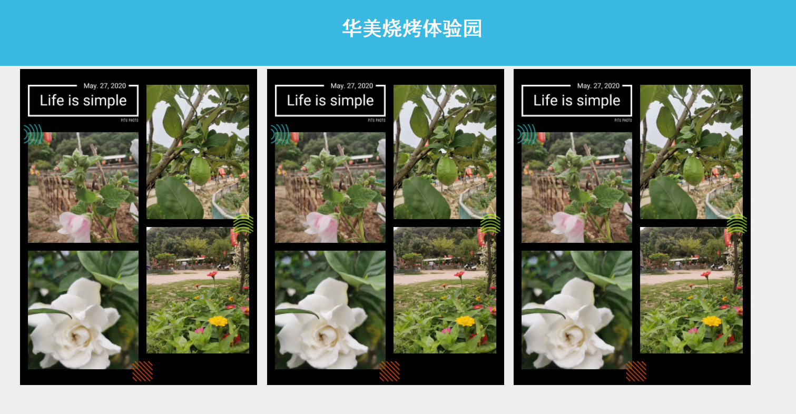

# 开始布局html

- HTML+CSS 学习之路

  - 基础标签和样式的使用

    HTML 语句

    ```html
    <div class="head">华美烧烤体验园</div>
    ```

    CSS

    ``` css
    <style type="text/css">
    .head{
        background-color:#39b8e2;color:white;
        font-weight:bold;font-size: 30px;font-family: '黑体', Times, sans-serif;
        text-align:center;
        padding: 40px;
    }
    </style>
    ```

    具体配置一些属性  

    ```html
    <div class="head">华美烧烤体验园</div>
    <div class="content">
       <div class="pic-box" ></div>
       <div class="pic-box"></div>
       <div class="pic-box"></div>
    </div>
    ```

    ```css
    .content{
        width: 1200px;
        margin-left: auto;margin-right: auto;
    }
    .pic-box{
        width: 280px;padding: 40px;margin: 5px;
        height: 400px;
        background-color: white;
        background-image: url("pic/flower.jpg");
        background-size: cover;
        display: inline-block;
        vertical-align: top;
    }
    ```

    
